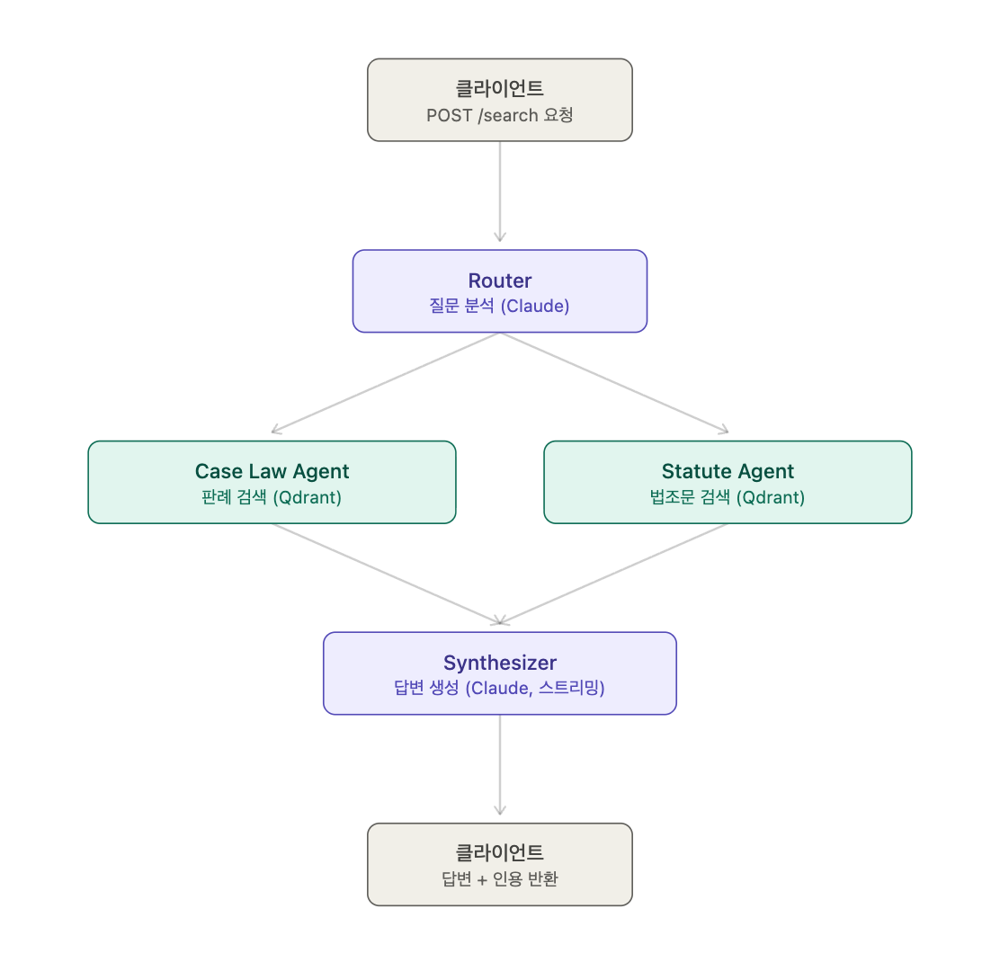
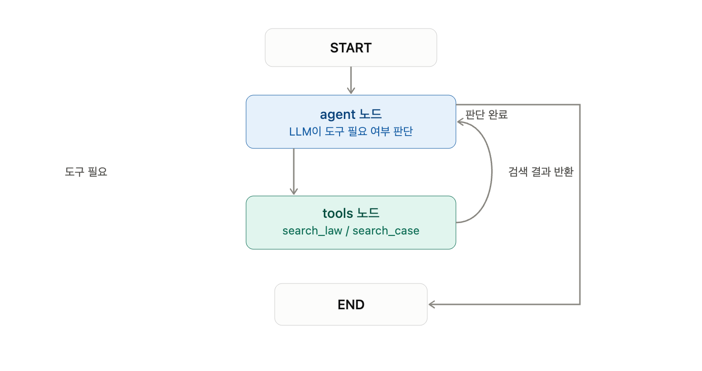
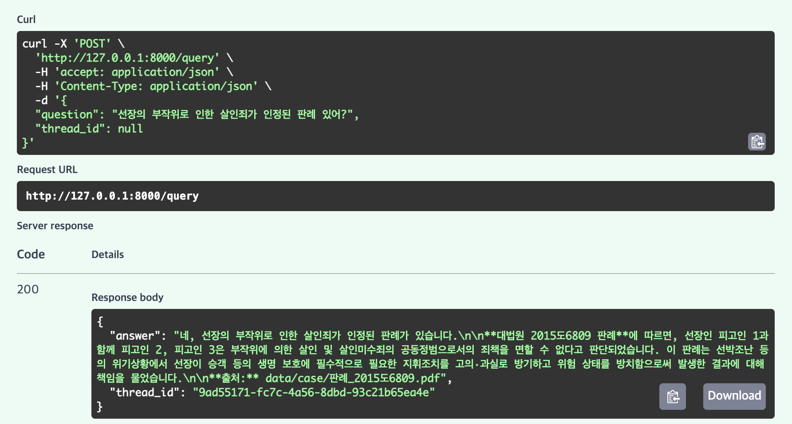
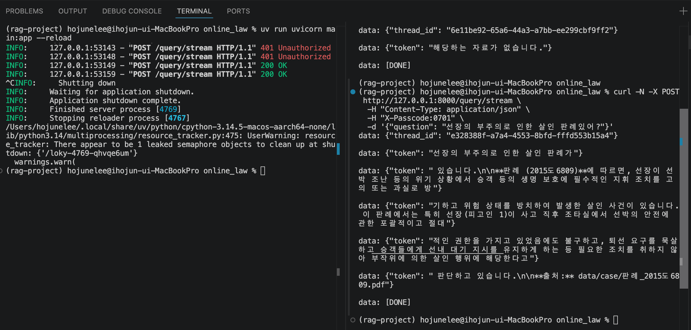

**구조**


## 설계

방식: bottm-up

케이스가 2개밖에 없으므로 멀티 에이전트가 아닌 ReAct Pattern으로 설계

## 7/7

판례 pdf 임베딩 및 vectore DB 적재

벡터 디비에 판례, 법령을 넣으면 Vector DB에 임베딩

## 7/8

**프로젝트 구조**

```bash
online_law/
├── .env 
├── .venv/ 
├── pyproject.toml
├── uv.lock
├── main.py
├── graph.py
├── vectordb.py
├── chroma_persist/ 
└── data/
      ├── law/ 
      └── case/
```

## 임베딩 재설계

vectordb.py 재설계

data폴더에 law(법령), case(판례)를 따로 두어 나눔

임베딩할 때 path와 doc_type를 매핑해 vectorDB에 넣음

## 그래프 설계

graph.py 설계

claude나 gemini를 활용할 수 있게 함

tool로 search_law와 search_case을 추가

법령 관련 질문이면 search_law, 판례 관련 질문이면 search_case

tool condition을 통해 종료 여부를 판단

**그래프 구조**


## 결과


## 7/9

문제 상황

새로운 법령, 판례가 추가되었을 때 기존 코드는 매번 vectorDB를 삭제했다가 다시 임베딩해야했음.

Manifest.json을 만들어 임베딩한 파일을 기록

폴더를 스캔해서 새 파일 or 변경된 파일만 찾아낸 후 임베딩

파일이 바뀐 경우 파일에 해당하는 기존 청크만 삭제하고 다시 추가

정량 평가를 위한 langsmith 도입

## 7/15

대화형 Agent

checkpoint, thread_id를 통해 대화형 Agent 구현

현재 메세지가 직렬로 checkpoint.db에 쌓임 매 메시지마다 누적하는게 아니라 1개씩 새로 만드는 형식

splitesaver로 파일기반 대화 이력 저장

checkpoints.db

trimming도입

summart_messages 노드 추가 

메시지가 20개가 넘어가면 오래된 메시지 10개를 요약해서 DB에 저장

state에서 오래된 메시지 삭제 후 요약본으로 대체

성능 확인 + 스트리밍 확인
